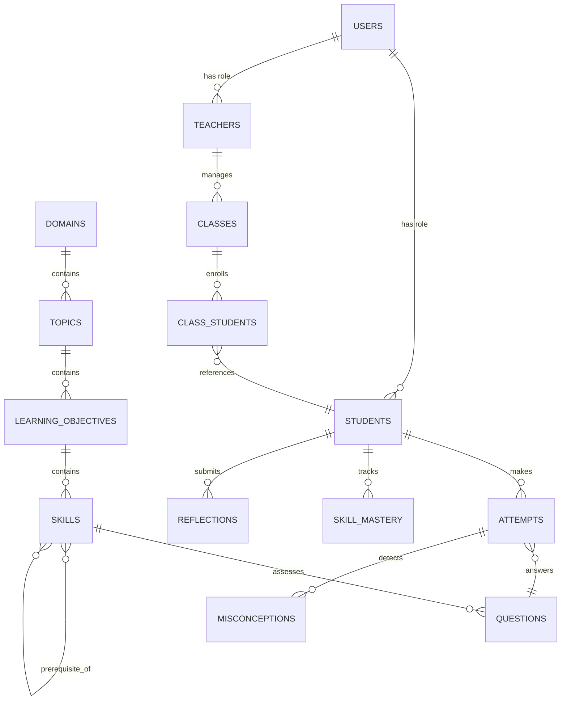

# DATABASE EVOLUTION: Math Explorer 6

> **Tài liệu thiết kế schema cho chuyển đổi từ localStorage → Firestore + Curriculum Engine**
> **Ngày:** 2026-06-17

---

## 1. TRẠNG THÁI HIỆN TẠI (Current State)

### 1.1 Không có database thật

Hiện tại, **TOÀN BỘ** dữ liệu lưu trong **localStorage** của trình duyệt:

```
localStorage Keys:
├── math_explorer_students     → { "student_minh": { StudentProfile } }
├── math_explorer_attempts     → { [id]: { Attempt } }
├── math_explorer_mistakes     → { [id]: { MistakeLog } }
├── math_explorer_reflections  → { [id]: { ReflectionResponse } }
├── gemini_api_key             → "AIza..."
├── gemini_selected_model      → "gemini-3-flash-preview"
└── math_explorer_lang         → "vi"
```

### 1.2 Curriculum Data = TypeScript constants

```
src/data/curriculumData.ts (93KB):
├── DEMO_UNITS: Unit[]           → 17 units
├── DEMO_LESSONS: Lesson[]       → 21 lessons (full content embedded)
└── DEMO_QUESTIONS: Question[]   → 20 questions (full content embedded)
```

### 1.3 Vấn đề

| # | Vấn đề | Hậu quả |
|---|--------|---------|
| 1 | Dữ liệu mất khi xóa cache/đổi trình duyệt | HS mất tiến độ |
| 2 | Không sync giữa các thiết bị | HS không học trên nhiều máy |
| 3 | GV không thấy dữ liệu HS | Dashboard GV dùng mock data |
| 4 | Curriculum hard-coded | Thay đổi bài học = sửa code |
| 5 | Không có mastery tracking | Không adaptive learning |
| 6 | Không có misconception patterns | AI không học từ lỗi sai |
| 7 | Single student model | Không hỗ trợ multi-user |

---

## 2. SCHEMA MỤC TIÊU (Target Schema)

### 2.1 Tổng quan Collections



---

### 2.2 Curriculum Collections (Read-only, Admin-managed)

#### Collection: `domains`

```typescript
interface Domain {
  id: string;                    // 'number' | 'geometry' | 'statistics' | 'algebra'
  name: {
    en: string;                  // 'Number'
    vi: string;                  // 'Số học'
  };
  color: string;                 // '#3B82F6' (for UI)
  icon: string;                  // 'Calculator'
  sortOrder: number;
  topicCount: number;            // denormalized
}
```

**Dữ liệu ban đầu:** 4 domains theo Cambridge Primary Mathematics Framework

---

#### Collection: `topics`

```typescript
interface Topic {
  id: string;                    // 'place-value', 'fractions', 'angles'
  domainId: string;              // FK → domains
  name: {
    en: string;                  // 'Place Value'
    vi: string;                  // 'Giá trị theo hàng'
  };
  description: {
    en: string;
    vi: string;
  };
  cambridgeCode: string;         // '6Npv', '6Fr', '6Gg'
  unitNumber: number;            // 1-17 (original unit mapping)
  prerequisites: string[];       // Topic IDs required before this
  difficulty: number;            // 1-5 (overall topic difficulty)
  sortOrder: number;
  stage: number;                 // 5 | 6 (Cambridge Stage)
}
```

**Dữ liệu ban đầu:** 17 topics từ DEMO_UNITS hiện tại

---

#### Collection: `learning_objectives`

```typescript
interface LearningObjective {
  id: string;                    // '6Npv.01', '6Fr.01'
  topicId: string;               // FK → topics
  code: string;                  // Cambridge code
  description: {
    en: string;                  // 'Understand place value of decimals...'
    vi: string;
  };
  skills: string[];              // Skill IDs under this objective
  thinkingSkills: ThinkingSkill[]; // Required thinking skills
}
```

---

#### Collection: `skills`

```typescript
interface Skill {
  id: string;                    // 'identify-digit-value-thousandths'
  objectiveId: string;           // FK → learning_objectives
  topicId: string;               // FK → topics (denormalized)
  name: {
    en: string;
    vi: string;
  };
  description: {
    en: string;
    vi: string;
  };
  difficulty: 1 | 2 | 3 | 4 | 5;
  prerequisiteSkills: string[];  // Skill IDs
  nextSkills: string[];          // Skill IDs
  thinkingSkills: ThinkingSkill[];
  questionCount: number;         // denormalized count
}
```

---

#### Collection: `lessons`

```typescript
interface LessonContent {
  id: string;                    // 'lesson_1'
  topicId: string;               // FK → topics
  title: {
    en: string;
    vi: string;
  };
  code: string;                  // 'L1'
  sortOrder: number;
  objectiveIds: string[];        // FK → learning_objectives

  // 5-Phase Content (giữ nguyên cấu trúc hiện tại)
  explore: {
    scenario: { en: string; vi: string };
    question: { en: string; vi: string };
    initialHint: { en: string; vi: string };
  };
  learn: {
    content: { en: string; vi: string }; // Markdown
    visualAidType?: string;
  };
  example: {
    problem: { en: string; vi: string };
    steps: {
      title: { en: string; vi: string };
      description: { en: string; vi: string };
      mathExpression?: string;
    }[];
  };
  reflection: {
    prompt: { en: string; vi: string };
    guidingQuestions: { en: string; vi: string }[];
  };

  // PDF Reference (từ LESSON_PDF_MAPPING hiện tại)
  textbookRef?: {
    volume: number;              // 1 | 2
    startPage: number;
    endPage: number;
    topic: string;
  };
}
```

---

#### Collection: `questions`

```typescript
interface QuestionDoc {
  id: string;                    // 'q1', hoặc auto-generated
  lessonId: string;              // FK → lessons
  topicId: string;               // FK → topics
  skillId: string;               // FK → skills
  objectiveId: string;           // FK → learning_objectives

  // Content
  questionText: { en: string; vi: string };
  type: 'multiple-choice' | 'text-input' | 'numeric' | 'open-ended';
  options?: { en: string; vi: string }[];
  correctAnswer: string;
  solution: { en: string; vi: string };
  hint: { en: string; vi: string };
  explanation: { en: string; vi: string };
  commonMistake: { en: string; vi: string };

  // Metadata
  difficulty: 'easy' | 'medium' | 'hard';
  thinkingSkill: ThinkingSkill;
  cognitiveLevel: 'recall' | 'understand' | 'apply' | 'analyze' | 'evaluate' | 'create';
  
  // Analytics (denormalized, updated periodically)
  totalAttempts: number;
  correctRate: number;           // 0-1
  avgTimeSeconds: number;
  commonMisconceptions: string[]; // misconception pattern IDs

  // Source
  source: 'curated' | 'ai-generated' | 'teacher-created';
  createdAt: string;
  isActive: boolean;
}
```

---

### 2.3 User Collections

#### Collection: `users`

```typescript
interface UserDoc {
  id: string;                    // Firebase Auth UID
  email: string;
  displayName: string;
  role: 'student' | 'teacher' | 'admin';
  language: 'en' | 'vi';
  createdAt: string;
  lastLoginAt: string;
  isActive: boolean;
}
```

---

#### Collection: `students` (sub-profile of users)

```typescript
interface StudentDoc {
  id: string;                    // = userId
  userId: string;                // FK → users
  classId: string;               // FK → classes
  displayName: string;

  // Gamification
  xp: number;
  level: number;
  badges: string[];              // badge IDs
  streakDays: number;
  lastActiveDate: string | null;
  longestStreak: number;

  // Progress Summary (denormalized)
  completedLessons: string[];    // lesson IDs
  completedTopics: string[];     // topic IDs
  totalQuestionsAttempted: number;
  totalCorrect: number;
  overallAccuracy: number;       // 0-1

  // AI Profile
  preferredDifficulty: 'easy' | 'medium' | 'hard';
  learningPace: 'slow' | 'normal' | 'fast';
  strongTopics: string[];        // topic IDs
  weakTopics: string[];          // topic IDs

  updatedAt: string;
}
```

---

#### Collection: `skill_mastery`

```typescript
// Path: students/{studentId}/skill_mastery/{skillId}

interface SkillMasteryDoc {
  id: string;                    // = skillId
  studentId: string;
  skillId: string;
  topicId: string;               // denormalized

  // Mastery Level
  level: 'not-started' | 'emerging' | 'developing' | 'secure' | 'mastered';
  score: number;                 // 0-100 (computed)

  // Evidence
  totalAttempts: number;
  correctAttempts: number;
  accuracy: number;              // correctAttempts / totalAttempts
  recentAccuracy: number;        // last 5 attempts accuracy
  consistency: number;           // 1 - variance(recent scores)

  // Time Tracking
  avgResponseTime: number;       // seconds
  speedTrend: 'improving' | 'stable' | 'declining';

  // Progression
  highestDifficultyPassed: 'easy' | 'medium' | 'hard';
  trend: 'improving' | 'stable' | 'declining';

  firstAttemptAt: string;
  lastAttemptAt: string;
  masteredAt: string | null;     // null if not mastered

  updatedAt: string;
}
```

**Mastery Score Calculation:**

```typescript
function calculateMasteryScore(mastery: SkillMasteryDoc): number {
  if (mastery.totalAttempts === 0) return 0;

  const weights = {
    recentAccuracy: 0.50,     // 50% — last 5 attempts
    consistency: 0.20,        // 20% — stability
    speedImprovement: 0.10,   // 10% — getting faster
    difficultyLevel: 0.20     // 20% — handling harder questions
  };

  const difficultyBonus =
    mastery.highestDifficultyPassed === 'hard' ? 1.0 :
    mastery.highestDifficultyPassed === 'medium' ? 0.6 : 0.3;

  const speedScore =
    mastery.speedTrend === 'improving' ? 1.0 :
    mastery.speedTrend === 'stable' ? 0.6 : 0.3;

  return Math.round(
    mastery.recentAccuracy * weights.recentAccuracy * 100 +
    mastery.consistency * weights.consistency * 100 +
    speedScore * weights.speedImprovement * 100 +
    difficultyBonus * weights.difficultyLevel * 100
  );
}

function determineMasteryLevel(score: number, attempts: number): MasteryLevel {
  if (attempts === 0) return 'not-started';
  if (score >= 90 && attempts >= 5) return 'mastered';
  if (score >= 75) return 'secure';
  if (score >= 50) return 'developing';
  return 'emerging';
}
```

---

### 2.4 Activity Collections

#### Collection: `attempts`

```typescript
interface AttemptDoc {
  id: string;                    // auto-generated
  studentId: string;             // FK → students
  questionId: string;            // FK → questions
  lessonId: string;              // FK → lessons
  topicId: string;               // FK → topics (denormalized)
  skillId: string;               // FK → skills (denormalized)

  // Answer
  userAnswer: string;
  isCorrect: boolean;
  scoreGained: number;           // XP gained (0 if incorrect)
  timeSpentSeconds: number;      // Time from question shown to submit

  // AI Analysis
  misconceptionId: string | null; // FK → misconception_patterns
  aiConfidence: number;          // 0-1, AI's confidence in misconception detection

  timestamp: string;
}
```

---

#### Collection: `misconception_patterns`

```typescript
interface MisconceptionPatternDoc {
  id: string;                    // auto-generated
  skillId: string;               // FK → skills
  topicId: string;               // FK → topics

  // Pattern
  name: { en: string; vi: string }; // 'Decimal Place Confusion'
  description: { en: string; vi: string };
  category: string;              // 'Calculation Error', 'Conceptual Gap', 'Reading Error'
  examples: string[];            // Example wrong answers

  // Remediation
  remediation: { en: string; vi: string }; // AI-generated fix strategy
  prerequisiteGaps: string[];    // Skills that need reinforcement

  // Analytics (updated periodically)
  totalOccurrences: number;
  uniqueStudents: number;
  resolvedCount: number;         // Students who overcame this

  createdAt: string;
  updatedAt: string;
}
```

---

#### Collection: `reflections`

```typescript
interface ReflectionDoc {
  id: string;
  studentId: string;
  lessonId: string;
  topicId: string;               // denormalized

  answers: {
    question: string;
    response: string;
  }[];

  // AI Grading
  grade: 'Master' | 'Good' | 'Needs Work';
  feedback: string;
  thinkingSkillsAssessed: ThinkingSkill[];

  // XP
  xpAwarded: number;

  timestamp: string;
}
```

---

### 2.5 Teacher Collections

#### Collection: `classes`

```typescript
interface ClassDoc {
  id: string;                    // 'class_5a1'
  teacherId: string;             // FK → users
  name: string;                  // '5A1'
  grade: number;                 // 5 | 6
  academicYear: string;          // '2025-2026'
  studentCount: number;          // denormalized

  // Class-wide analytics (updated periodically)
  avgMasteryScore: number;
  avgAccuracy: number;
  topWeakTopics: string[];       // top 3 topic IDs
  topMisconceptions: string[];   // top 3 misconception IDs

  createdAt: string;
  updatedAt: string;
}
```

#### Collection: `class_students`

```typescript
// Path: classes/{classId}/students/{studentId}

interface ClassStudentDoc {
  studentId: string;             // FK → students
  enrolledAt: string;
  isActive: boolean;
}
```

---

### 2.6 AI Conversation Collections

#### Collection: `ai_conversations`

```typescript
interface AIConversationDoc {
  id: string;
  studentId: string;
  questionId: string;
  topicId: string;               // denormalized

  messages: {
    role: 'student' | 'coach';
    text: string;
    timestamp: string;
  }[];

  // Session metadata
  misconceptionDetected: string | null;
  turnsToResolve: number | null;
  wasResolved: boolean;
  thinkingSkillsUsed: ThinkingSkill[];

  startedAt: string;
  endedAt: string | null;
}
```

---

## 3. KẾ HOẠCH MIGRATION

### 3.1 Phase 0: Dual-mode adapter (không mất dữ liệu)

```typescript
// services/storage/storageAdapter.ts

class StorageAdapter {
  private useFirestore: boolean;

  // Đọc từ Firestore nếu có, fallback localStorage
  async get(collection: string, id: string): Promise<any> {
    if (this.useFirestore) {
      const doc = await firestore.get(collection, id);
      if (doc) return doc;
    }
    return this.getFromLocalStorage(collection, id);
  }

  // Ghi vào cả hai (để migrate dần)
  async save(collection: string, id: string, data: any): Promise<void> {
    this.saveToLocalStorage(collection, id, data);
    if (this.useFirestore) {
      await firestore.save(collection, id, data);
    }
  }

  // Migration: đẩy toàn bộ localStorage lên Firestore
  async migrateToCloud(): Promise<MigrationResult> {
    const collections = ['students', 'attempts', 'mistakes', 'reflections'];
    for (const coll of collections) {
      const localData = this.getLocalCollection(coll);
      for (const [id, data] of Object.entries(localData)) {
        await firestore.save(coll, id, data);
      }
    }
  }
}
```

### 3.2 Phase 1: Curriculum data migration

```
curriculumData.ts (93KB)
  ↓ parse & transform
  ├── curriculum/domains.json        (4 domains)
  ├── curriculum/topics.json         (17 topics)
  ├── curriculum/objectives.json     (learning objectives)
  ├── curriculum/skills.json         (skill definitions)
  ├── curriculum/skill-graph.json    (prerequisite edges)
  ├── curriculum/lessons/
  │   ├── unit-01-lessons.json
  │   ├── unit-02-lessons.json
  │   └── ... (17 files)
  └── curriculum/question-bank/
      ├── unit-01-questions.json
      ├── unit-02-questions.json
      └── ... (17 files)
```

**Backward compatibility wrapper:**

```typescript
// src/data/curriculumData.ts (modified - thin wrapper)

import domainsJson from '../curriculum/domains.json';
import topicsJson from '../curriculum/topics.json';
import lessonsJson from '../curriculum/lessons/*.json';
import questionsJson from '../curriculum/question-bank/*.json';

// Maintain exact same exports for existing components
export const DEMO_UNITS: Unit[] = topicsJson.map(topicToUnit);
export const DEMO_LESSONS: Lesson[] = Object.values(lessonsJson).flat();
export const DEMO_QUESTIONS: Question[] = Object.values(questionsJson).flat();
```

### 3.3 Phase 2: Firebase schema deployment

```
Firestore Collections:
├── domains/            (seeded from JSON)
├── topics/             (seeded from JSON)
├── learning_objectives/
├── skills/
├── lessons/
├── questions/
├── users/
├── students/
│   └── {studentId}/
│       └── skill_mastery/
├── classes/
│   └── {classId}/
│       └── students/
├── attempts/
├── reflections/
├── misconception_patterns/
└── ai_conversations/
```

### 3.4 Firestore Security Rules

```javascript
rules_version = '2';
service cloud.firestore {
  match /databases/{database}/documents {

    // Curriculum: read-only for all authenticated users
    match /domains/{domainId} {
      allow read: if request.auth != null;
    }
    match /topics/{topicId} {
      allow read: if request.auth != null;
    }
    match /lessons/{lessonId} {
      allow read: if request.auth != null;
    }
    match /questions/{questionId} {
      allow read: if request.auth != null;
    }

    // Students: read/write own data
    match /students/{studentId} {
      allow read, write: if request.auth.uid == studentId;
      allow read: if isTeacherOfStudent(studentId);

      match /skill_mastery/{skillId} {
        allow read, write: if request.auth.uid == studentId;
        allow read: if isTeacherOfStudent(studentId);
      }
    }

    // Attempts: students write own, teachers read class
    match /attempts/{attemptId} {
      allow create: if request.auth.uid == request.resource.data.studentId;
      allow read: if request.auth.uid == resource.data.studentId
                  || isTeacherOfStudent(resource.data.studentId);
    }

    // Teachers: manage own classes
    match /classes/{classId} {
      allow read, write: if request.auth.uid == resource.data.teacherId;
      
      match /students/{studentId} {
        allow read, write: if request.auth.uid == get(/databases/$(database)/documents/classes/$(classId)).data.teacherId;
      }
    }

    // Helper function
    function isTeacherOfStudent(studentId) {
      let student = get(/databases/$(database)/documents/students/$(studentId));
      let classDoc = get(/databases/$(database)/documents/classes/$(student.data.classId));
      return request.auth.uid == classDoc.data.teacherId;
    }
  }
}
```

---

## 4. INDEX REQUIREMENTS

### Firestore Composite Indexes

```yaml
indexes:
  - collection: attempts
    fields:
      - { fieldPath: studentId, order: ASCENDING }
      - { fieldPath: timestamp, order: DESCENDING }

  - collection: attempts
    fields:
      - { fieldPath: studentId, order: ASCENDING }
      - { fieldPath: skillId, order: ASCENDING }
      - { fieldPath: timestamp, order: DESCENDING }

  - collection: attempts
    fields:
      - { fieldPath: topicId, order: ASCENDING }
      - { fieldPath: isCorrect, order: ASCENDING }

  - collection: questions
    fields:
      - { fieldPath: skillId, order: ASCENDING }
      - { fieldPath: difficulty, order: ASCENDING }
      - { fieldPath: isActive, order: ASCENDING }

  - collection: misconception_patterns
    fields:
      - { fieldPath: topicId, order: ASCENDING }
      - { fieldPath: totalOccurrences, order: DESCENDING }
```

---

## 5. DATA SEEDING SCRIPT

Khi khởi tạo hệ thống lần đầu, cần:

1. **Parse `curriculumData.ts`** → extract 17 units, 21 lessons, 20 questions
2. **Map units → domains + topics** (manual mapping)
3. **Extract learning objectives** từ lesson `learningObjectives` field
4. **Define skills** dựa trên question `skill` field + manual enrichment
5. **Build skill graph** — define prerequisites manually cho 17 topics
6. **Seed Firestore** — upload all curriculum data
7. **Create demo student** — migrate INITIAL_STUDENT data
8. **Create demo class** — seed class_5a1 with demo teacher

---

## 6. MIGRATION TIMELINE

| Giai đoạn | Tuần | Nội dung |
|-----------|------|---------|
| **Prep** | 1 | Viết migration script, tạo JSON files từ curriculumData.ts |
| **Dual Mode** | 2 | StorageAdapter dual-mode (localStorage + Firestore) |
| **Curriculum JSON** | 3 | Tách curriculumData.ts → JSON files, backward compat wrapper |
| **Firebase Deploy** | 4 | Deploy Firestore schema, security rules, indexes |
| **Skill Mastery** | 5-6 | Implement skill_mastery subcollection + calculator |
| **Misconceptions** | 7-8 | Implement misconception_patterns + AI detection |
| **Analytics** | 9-10 | Implement class analytics from real Firestore data |

> [!IMPORTANT]
> Mỗi giai đoạn phải giữ app hoạt động. Không bao giờ break existing functionality.
