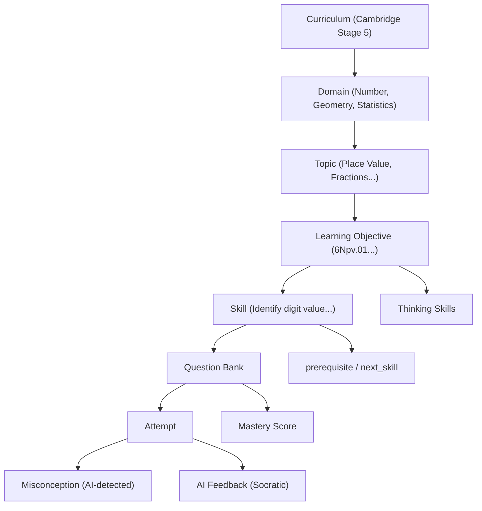

# UPGRADE PLAN: Math Explorer 6 → AI-Powered Cambridge Mathematics Learning System

> **Tác giả:** Senior Software Architect & EdTech Product Designer
> **Ngày:** 2026-06-17
> **Phiên bản mục tiêu:** 3.0 (từ MVP hiện tại)

---

## PHẦN A: KIỂM TRA KIẾN TRÚC HIỆN TẠI (Architecture Audit)

### A.1 Tổng quan hệ thống

```
┌─────────────────────────────────────────────────────┐
│                    CLIENT (React 19)                 │
│                                                     │
│  App.tsx (God Orchestrator, 11 useState hooks)       │
│    ├── Navbar.tsx                                    │
│    ├── StudentPaths.tsx (1274 dòng, 17 useState!)    │
│    │     ├── GeometrySandbox.tsx                     │
│    │     └── MathRunnerGame.tsx                      │
│    ├── TeacherMetrics.tsx (745 dòng, mock data)      │
│    ├── AICoachModal.tsx                              │
│    └── SettingsModal.tsx                             │
│                                                     │
│  Dữ liệu: curriculumData.ts (93KB, 2213 dòng)      │
│  State: localStorage / Firebase (chưa cấu hình)     │
└────────────────────┬────────────────────────────────┘
                     │ HTTP (x-api-key header)
┌────────────────────▼────────────────────────────────┐
│               SERVER (Express.js + Vite)             │
│                                                     │
│  7 API Endpoints:                                    │
│  POST /api/gemini/tutor         (Socratic AI)        │
│  POST /api/gemini/grade-reflection                   │
│  POST /api/gemini/model-solution                     │
│  POST /api/textbook/extract     (PDF → Gemini)       │
│  GET  /api/export/docx          (Python subprocess)  │
│  GET  /api/export/pptx          (Python subprocess)  │
│  GET  /api/health                                    │
│                                                     │
│  Python Scripts: extract_pages.py, generate_*.py     │
│  PDF Files: Vol 1 (87MB) + Vol 2 (73MB)              │
└─────────────────────────────────────────────────────┘
```

### A.2 Thống kê mã nguồn

| Tệp | Dòng code | Kích thước | Vai trò |
|------|-----------|------------|---------|
| `curriculumData.ts` | 2,213 | 93 KB | Toàn bộ nội dung bài học + câu hỏi hard-code |
| `StudentPaths.tsx` | 1,274 | 64 KB | GOD COMPONENT: Điều hướng, bài tập, đánh giá, SGK, badge |
| `TeacherMetrics.tsx` | 745 | 36 KB | Dashboard giáo viên (phần lớn dữ liệu mock) |
| `GeometrySandbox.tsx` | 663 | 26 KB | Canvas hình học tương tác |
| `AICoachModal.tsx` | 440 | 20 KB | Chat AI Socratic + Model Solution |
| `server.ts` | 649 | 28 KB | Express server + Gemini proxy |
| `App.tsx` | 283 | 10 KB | Root orchestrator, 11 useState |
| **Tổng cộng** | **~6,700** | **~300 KB** | |

### A.3 Đánh giá điểm mạnh

| # | Điểm mạnh | Chi tiết |
|---|-----------|---------|
| ✅ | **Bilingual-by-design** | Mọi text đều có EN/VI, hệ thống `BilingualOrString` + `t()` context |
| ✅ | **Socratic AI philosophy** | AI Coach KHÔNG đưa đáp án, chỉ đặt câu hỏi gợi mở — đúng triết lý sư phạm |
| ✅ | **Graceful degradation** | Mọi endpoint đều có offline fallback hoạt động được khi không có API key |
| ✅ | **Cambridge alignment** | 17 Units theo chuẩn Cambridge Stage 6, Learning Objectives có mã CAIE |
| ✅ | **5-phase lesson** | Explore → Learn → Example → Practice → Reflection — quy trình sư phạm tốt |
| ✅ | **Gamification core** | XP, Levels, Streaks, Badges, MathRunner game |
| ✅ | **PDF extraction** | Trích xuất nội dung từ sách giáo khoa gốc (2 quyển PDF, 160MB) |
| ✅ | **Model Solution** | Tab "Bài giải HS Giỏi" — cho HS tham khảo cách giải mẫu |

### A.4 Đánh giá điểm yếu (Critical Issues)

| Mức độ | Vấn đề | Tác động |
|--------|--------|---------|
| 🔴 **Critical** | **God Component** — `StudentPaths.tsx` (1274 dòng, 17 useState) quản lý mọi thứ trong 1 file | Không thể maintain, test, hay mở rộng |
| 🔴 **Critical** | **Hard-coded curriculum** — 93KB dữ liệu bài học trong 1 file TypeScript. Không có Curriculum Engine | Thêm/sửa bài học phải sửa code. Không scale |
| 🔴 **Critical** | **Không có database schema thật** — Firebase config rỗng, mọi thứ lưu localStorage | Dữ liệu mất khi xóa cache. Không sync nhiều thiết bị |
| 🔴 **Critical** | **Teacher dashboard = mock data** — 80% dữ liệu giáo viên là hard-code | GV không xem được dữ liệu thật |
| 🟠 **Major** | **Không có Skill/Mastery tracking** — Chỉ lưu attempts, không tính mastery level | Không adaptive learning |
| 🟠 **Major** | **Không có Misconception engine** — Phân loại lỗi sai bằng string matching đơn giản | AI không học từ pattern lỗi sai |
| 🟠 **Major** | **API key management** — Đọc trực tiếp từ localStorage trong 3+ component | Vi phạm single source of truth |
| 🟠 **Major** | **Streak bug** — `streakDays + 1` chạy mỗi câu đúng, không check theo ngày | Streak tăng sai |
| 🟠 **Major** | **Badge unlock unreliable** — `dummySolvedMap` luôn set count = 3 | Badge unlock không phản ánh thực tế |
| 🟡 **Minor** | Không có routing library, code splitting, error boundaries, unit tests | UX và stability |

---

## PHẦN B: KIẾN TRÚC MỤC TIÊU (Target Architecture)

### B.1 Mô hình dữ liệu Curriculum Intelligence



### B.2 Cấu trúc thư mục mục tiêu

```
src/
├── app/
│   ├── App.tsx                    # Chỉ routing + providers
│   ├── routes/
│   └── providers/
│       ├── AuthProvider.tsx
│       ├── CurriculumProvider.tsx
│       └── SettingsProvider.tsx
│
├── features/
│   ├── curriculum/                # Phase 1: Curriculum Engine
│   │   ├── CurriculumMap.tsx
│   │   ├── LessonView.tsx
│   │   └── SkillTree.tsx
│   │
│   ├── practice/                  # Phase 3: Smart Practice
│   │   ├── PracticeEngine.tsx
│   │   ├── QuestionCard.tsx
│   │   ├── AnswerInput.tsx
│   │   └── FeedbackPanel.tsx
│   │
│   ├── ai-coach/                  # Phase 2: AI Math Coach
│   │   ├── AICoachDrawer.tsx
│   │   ├── SocraticChat.tsx
│   │   └── ModelSolution.tsx
│   │
│   ├── teacher/                   # Phase 4: Teacher Intelligence
│   │   ├── ClassAnalytics.tsx
│   │   ├── MasteryHeatmap.tsx
│   │   └── InterventionPlanner.tsx
│   │
│   ├── portfolio/                 # Phase 5: Student Portfolio
│   │   ├── ProgressDashboard.tsx
│   │   ├── SkillMasteryChart.tsx
│   │   └── MistakeTimeline.tsx
│   │
│   └── gamification/
│       ├── BadgeSystem.tsx
│       └── XPTracker.tsx
│
├── services/
│   ├── curriculum/
│   │   ├── curriculumService.ts
│   │   ├── skillGraphService.ts
│   │   └── questionBankService.ts
│   │
│   ├── ai/
│   │   ├── geminiClient.ts
│   │   ├── socraticEngine.ts
│   │   ├── misconceptionDetector.ts
│   │   └── adaptiveEngine.ts
│   │
│   ├── analytics/
│   │   ├── masteryCalculator.ts
│   │   └── classAnalytics.ts
│   │
│   └── storage/
│       ├── firebaseService.ts
│       └── localStorageAdapter.ts
│
├── shared/
│   ├── components/
│   ├── hooks/
│   └── types/
│
└── curriculum/                    # Static curriculum data (JSON)
    ├── domains.json
    ├── skill-graph.json
    └── question-bank/
```

---

## PHẦN C: ROADMAP NÂNG CẤP THEO PHASE

### ƯU TIÊN: Learning Intelligence > Curriculum accuracy > AI feedback > Analytics > Visual polish

---

### PHASE 0: Foundation Refactor (Tuần 1-2)

> **Mục tiêu:** Tách God Components, thiết lập architecture mới. **KHÔNG thay đổi UI.**

#### 0.1 Decompose StudentPaths.tsx (1274 dòng → 6 components)

| Component mới | Chức năng | Ước tính |
|---------------|-----------|----------|
| `LessonNavigator.tsx` | Sidebar chọn Unit/Lesson | ~150 dòng |
| `LessonStepper.tsx` | 5-phase navigation stepper | ~100 dòng |
| `ExplorePhase.tsx` | Scenario + question phase | ~80 dòng |
| `LearnPhase.tsx` | Theory + visual aids | ~200 dòng |
| `PracticePhase.tsx` | Quiz engine + game mode | ~300 dòng |
| `ReflectionPhase.tsx` | Self-assessment + AI grading | ~150 dòng |

#### 0.2 Extract services

| Service | Chức năng |
|---------|-----------|
| `services/ai/geminiClient.ts` | Centralized API key management + request helper |
| `services/storage/storageService.ts` | Unified storage abstraction |
| `services/gamification/xpService.ts` | XP calculation + badge evaluation |

#### 0.3 Create shared contexts

| Context | Thay thế |
|---------|---------|
| `SettingsContext` | localStorage reads cho API key trong 3+ components |
| `StudentContext` | Prop drilling student profile qua 3 levels |

#### 0.4 Fix critical bugs
- Streak tăng theo ngày thay vì theo câu trả lời
- Badge evaluation dùng dữ liệu thật thay vì `dummySolvedMap`
- Error boundaries cho từng feature area

---

### PHASE 1: Curriculum Intelligence (Tuần 3-4)

> **Mục tiêu:** Xây dựng Curriculum Engine thay cho hard-coded data

#### 1.1 Curriculum Data Model

```typescript
interface CurriculumDomain {
  id: string;                    // 'number', 'geometry', 'statistics'
  name: BilingualOrString;
  topics: Topic[];
}

interface Topic {
  id: string;                    // 'place-value', 'fractions'
  domainId: string;
  name: BilingualOrString;
  learningObjectives: LearningObjective[];
  prerequisites: string[];       // topic IDs
  cambridgeCode: string;         // '6Npv', '6Fr'
}

interface Skill {
  id: string;                    // 'identify-digit-value-thousandths'
  objectiveId: string;
  name: BilingualOrString;
  difficulty: 1 | 2 | 3 | 4 | 5;
  prerequisiteSkills: string[];  // Skill IDs
  nextSkills: string[];          // Skill IDs
  thinkingSkills: ThinkingSkill[];
}
```

#### 1.2 Migrate từ curriculumData.ts → JSON files

- Chuyển 17 units → `curriculum/domains.json`
- Chuyển 21 lessons → lesson content tách theo unit
- Chuyển 20 questions → `curriculum/question-bank/` (tách theo topic)
- Giữ backward compatibility: export wrapper functions

---

### PHASE 2: AI Math Coach Upgrade (Tuần 5-6)

> **Mục tiêu:** Nâng cấp AI từ chat bot → Intelligent Tutor

#### 2.1 Misconception Detection Engine

```typescript
interface MisconceptionAnalysis {
  detectedMisconception: MisconceptionPattern | null;
  confidence: number;           // 0-1
  scaffoldQuestions: string[];  // Câu hỏi gợi mở theo thứ tự
  suggestedRemediation: string;
}
```

#### 2.2 Multi-turn Socratic Strategy

```
Turn 1: Xác định misconception
  → "Em thử nghĩ xem 20 có thể tách thành những phần nào?"

Turn 2: Scaffold nhỏ hơn nếu HS vẫn sai
  → "Đúng rồi, 20 = 2 × 10. Vậy 345 × 2 bằng bao nhiêu?"

Turn 3: Xác nhận hiểu biết
  → "Giỏi lắm! Bây giờ em thử nhân kết quả đó với 10 xem sao?"

Turn 4: Tổng hợp bài học
  → "Em đã tìm ra: 345 × 20 = 345 × 2 × 10 = 6900! 🎉"
```

#### 2.3 Enhanced System Prompt

Thêm vào system prompt:
- Thông tin mastery level của HS cho topic hiện tại
- Lịch sử misconceptions trước đó
- Skill prerequisite graph context
- Cambridge Thinking Skills mà câu hỏi yêu cầu

---

### PHASE 3: Smart Practice Engine (Tuần 7-8)

> **Mục tiêu:** Câu hỏi adaptive dựa trên mastery, KHÔNG random

#### 3.1 Mastery Calculation

```typescript
interface SkillMastery {
  skillId: string;
  level: 'not-started' | 'emerging' | 'developing' | 'secure' | 'mastered';
  score: number;          // 0-100
  attemptsCount: number;
  correctRate: number;    // 0-1
  lastAttemptDate: string;
  trend: 'improving' | 'stable' | 'declining';
}

// Mastery = weighted average:
// - Recent accuracy (last 5 attempts): 50%
// - Consistency (variance of scores): 20%
// - Speed improvement: 10%
// - Difficulty level handled: 20%
```

#### 3.2 Adaptive Question Selection

```typescript
function selectNextQuestion(
  studentMastery: SkillMastery[],
  availableQuestions: Question[],
  recentAttempts: Attempt[]
): Question {
  // 1. Identify weakest skills (emerging/developing)
  // 2. Check prerequisite mastery
  // 3. Select difficulty based on mastery level:
  //    - emerging → easy (recognition, recall)
  //    - developing → medium (application)
  //    - secure → hard (analysis, synthesis)
  // 4. Avoid recently attempted questions
  // 5. Prioritize declining skills
  // 6. Mix 20% review from mastered skills (spaced repetition)
}
```

---

### PHASE 4: Teacher Intelligence Dashboard (Tuần 9-10)

> **Mục tiêu:** Dashboard thật, dùng dữ liệu thật, KHÔNG mock

| Component | Hiện tại | Sau nâng cấp |
|-----------|----------|--------------|
| Topic Mastery Heatmap | ❌ Mock | ✅ Computed từ attempts |
| Common Mistakes | ❌ Hard-coded | ✅ AI-detected patterns |
| Weak Skills | ❌ N/A | ✅ Từ mastery calculator |
| Intervention Plans | ❌ Hard-coded | ✅ AI-generated per student |
| Student Roster | ⚠️ Mixed mock/real | ✅ Firebase data |

---

### PHASE 5: Student Portfolio (Tuần 11-12)

> **Mục tiêu:** AI Learning Portfolio cho mỗi học sinh

Theo dõi:
- **Kỹ năng đã đạt** — Skill mastery timeline
- **Bài làm tiêu biểu** — Best work highlights
- **Lỗi sai lặp lại** — Recurring misconceptions + resolution status
- **Tiến bộ theo thời gian** — Weekly progress charts
- **AI Summary** — Tóm tắt AI tạo tự động hàng tuần

---

### PHASE 6: Cambridge Thinking Skills (Tuần 13-14)

> **Mục tiêu:** Câu hỏi phát triển tư duy, không chỉ tính toán

| Thinking Skill | Dạng câu hỏi | Ví dụ |
|---------------|--------------|-------|
| **Explain** | Giải thích tại sao | "Tại sao 0.9 > 0.09?" |
| **Reason** | Suy luận kết quả | "Nếu nhân với 100, chữ số dịch chuyển thế nào?" |
| **Find Pattern** | Tìm quy luật | "Nhận thấy quy luật gì trong dãy: 0.1, 0.01, 0.001?" |
| **Generalise** | Khái quát hóa | "Quy tắc này có luôn đúng không? Chứng minh." |
| **Convince** | Thuyết phục | "Thuyết phục bạn rằng 3/4 > 5/8." |
| **Improve** | Cải tiến | "Tìm cách giải hiệu quả hơn." |

---

## PHẦN D: THỨ TỰ ƯU TIÊN

```
Phase 0: Foundation Refactor          ██████████  [BẮT BUỘC - Phải làm trước]
Phase 1: Curriculum Intelligence      ████████    [Nền tảng cho mọi thứ]
Phase 2: AI Math Coach Upgrade        ███████     [Giá trị cốt lõi]
Phase 3: Smart Practice Engine        ██████      [Adaptive learning]
Phase 4: Teacher Intelligence         █████       [Giá trị cho GV]
Phase 5: Student Portfolio            ████        [Long-term tracking]
Phase 6: Cambridge Thinking Skills    ████        [Chất lượng câu hỏi]
```

### Nguyên tắc thực hiện

1. **Không thay đổi UI lớn** cho đến khi data layer ổn định
2. **Backward compatible** — app phải chạy được sau mỗi phase
3. **Test mỗi thay đổi** — Viết test cho business logic
4. **Refactor trước, thêm tính năng sau** — Phase 0 phải xong trước Phase 1
5. **Curriculum data = source of truth** — Mọi thứ dẫn xuất từ curriculum

---

## PHẦN E: RỦI RO VÀ GIẢM THIỂU

| Rủi ro | Mức độ | Giảm thiểu |
|--------|--------|-----------|
| curriculumData.ts migration gây regression | Cao | Export compatibility layer, A/B test |
| Firebase migration mất dữ liệu localStorage | TB | Migration script tự động |
| AI quota exceeded (Gemini rate limits) | TB | Aggressive caching, offline fallbacks |
| Quá nhiều thay đổi cùng lúc | Cao | Strict phase discipline |
| Teacher dashboard chưa có real users | Thấp | Seed data + demo mode |
